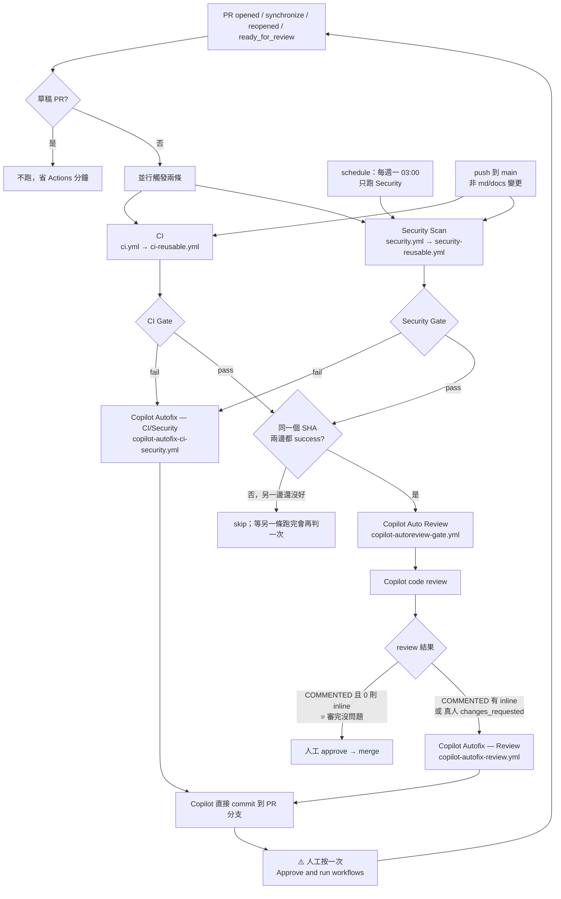
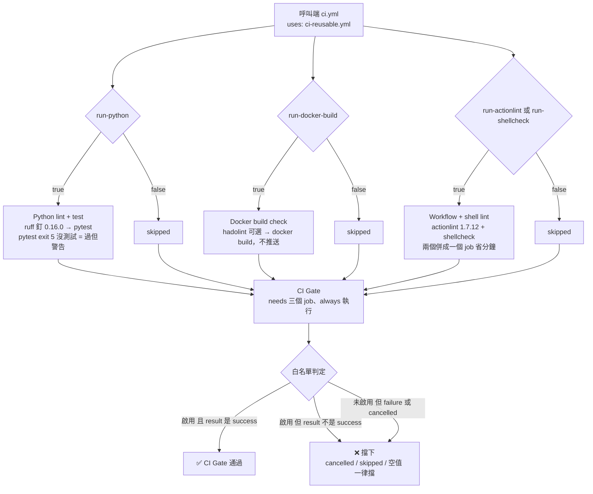
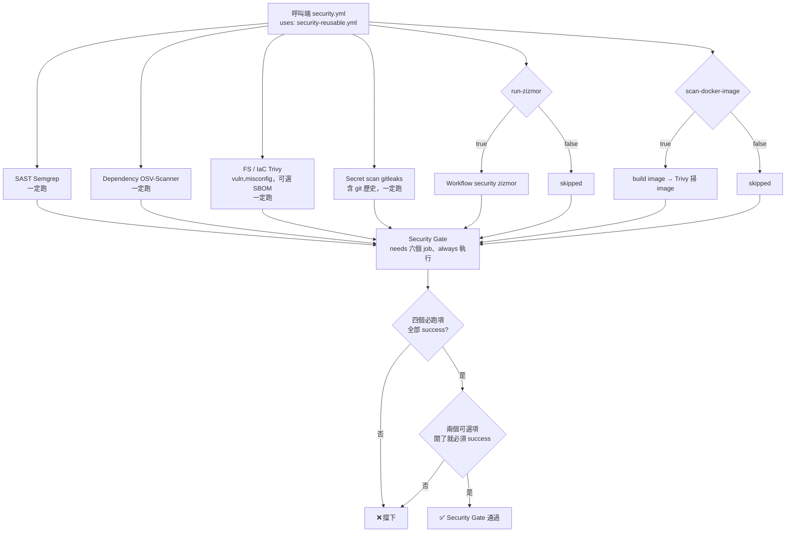
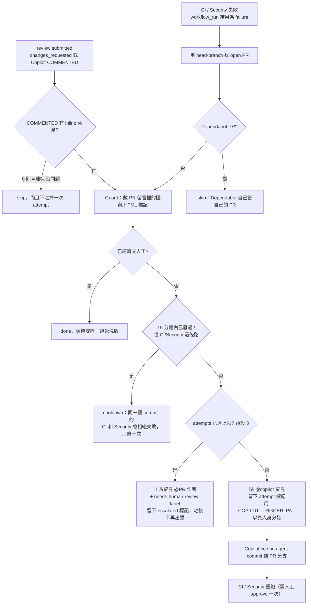

# 流程圖：這個 repo 到底在做什麼

> 這份是「看 README 之前的地圖」。README 是完整手冊（導入步驟、參數、疑難排解），
> 這份只回答一件事：**一個 PR 從打開到能 merge，中間到底發生什麼事、由哪支檔案負責。**
> 圖是從 `.github/workflows/` 的實際內容整理出來的。

---

## 0. 一句話版

這個 repo **自己不做任何事**，它是一包「別的專案用一行 `uses:` 呼叫的 workflow」。
各專案只放二十幾行、沒有邏輯的**呼叫端**；所有檢查邏輯集中在這裡，改一次全部專案跟著更新。

所以看這個 repo 要先分清楚兩種檔案 —— 它們都在同一個 `.github/workflows/` 目錄下，最容易搞混：

| 類型 | 檔名特徵 | 誰會有 | 作用 |
|---|---|---|---|
| **公版本體** | `*-reusable.yml` | 只有這個 repo | 真正的檢查邏輯，被別人 `uses:` 呼叫 |
| **呼叫端** | `ci.yml`、`security.yml`、`copilot-*.yml`（不含 reusable） | 每個導入的專案都有一份 | 只寫「什麼時候觸發」＋「傳什麼參數」 |
| **工具測試** | `adopt-tests.yml` | 只有這個 repo | 測 `scripts/adopt.*` 導入腳本，跟公版無關 |

這個 repo 自己也放了一份呼叫端（用 `./` 相對路徑呼叫自己的 reusable），
所以**公版是自己的第一個使用者** —— 改壞公版，在那個 PR 上當場就會紅。

---

## 1. 主流程：一個 PR 的一生

讀這張圖要記住四件事：

1. **CI 與 Security 是兩條獨立、並行的 workflow**，各自有自己的 Gate。分支保護只要求這兩個 Gate。
2. **Copilot 那三支是選配**，而且用 `workflow_run` 觸發 —— 這種觸發器只認 **default branch 上的檔案版本**，
   所以那幾支必須先 merge 進 `main` 才會生效（在 PR 上改它們，改的內容不會在該 PR 生效）。
3. **推 main 或每週排程的結果不會進 Copilot 流程**（條件寫死只處理 pull_request 觸發的 run）——
   沒有 PR 可修、可審，起 job 只是白付分鐘。
4. **Copilot 推的 commit，CI 會卡在 `action_required`**，要人在 PR 頁按一次「Approve and run workflows」。
   GitHub 硬性規定，繞不掉；替代法是自己推個空 commit（`git commit --allow-empty`）。

---

## 2. CI Gate 裡面（`ci-reusable.yml`）

**Gate 的判定原則**：「**開了就必須 success**」，不是「只擋 failure」。
原因記在 `ci-reusable.yml` 的註解（2026-08-06 實測）：runner 排隊過久被 GitHub 取消時，
`needs.<job>.result` 拿到的值並不是 `cancelled`，舊寫法因此判定通過 —— Gate 是綠的，
但 actionlint 與 shellcheck 一行都沒跑。required check 形同虛設。

**為什麼要有 Gate 這個 job**：子 job 都有 `if` 條件，關掉時會變 `skipped`，
而 skipped 的 required check，GitHub 要嘛當它通過（等於沒檢查）、要嘛一直 pending。
所以分支保護只認 `CI Gate` / `Security Gate` 這兩個總結 job，公版日後增減工具也不必回頭改各專案的 ruleset。

> ⚠️ 改公版時的坑：**在 `ci-reusable.yml` 新增 job，一定要加進 `ci-gate` 的 `needs`**，否則那個 job 失敗也擋不住任何東西。

---

## 3. Security Gate 裡面（`security-reusable.yml`）

| 掃描 | 抓什麼 | 開關 |
|---|---|---|
| Semgrep | 程式碼寫法弱點（SQL injection、eval…） | 一定跑 |
| OSV-Scanner | 相依套件的已知 CVE | 一定跑 |
| Trivy（FS / IaC） | Dockerfile / K8s / Terraform 設定問題 | 一定跑 |
| gitleaks | 密鑰被 commit 進去（含 git 歷史） | 一定跑 |
| zizmor | workflow 自己的安全問題（腳本注入、權限過大、沒釘 SHA） | `run-zizmor` |
| Trivy（image） | build 出來的 image 裡的 CVE | `scan-docker-image` |

**為什麼不上傳 Security 分頁**：`upload-sarif` 預設 `false`。
reusable 的 `permissions` 是 `contents: read`，而 reusable 只能「縮減」呼叫端給的權限、不能擴張，
就算呼叫端給了 `security-events: write` 也可能被縮掉、upload 403。
改成存 artifact + 用 job 成敗當關卡，**私有 repo 不需要 GHAS 也能跑**。

---

## 4. Copilot 自動修的判定邏輯（兩條路共用同一個形狀）

**狀態存在哪**：沒有資料庫，**次數與狀態全記在 PR 留言的隱藏 HTML 註解裡** ——
`auto-fix-attempt`、`auto-fix-escalated`、`review-fix-attempt`、`review-fix-escalated`、
`auto-review-request:<sha>`。
所以「想重啟自動修正，把那則 🚨 留言刪掉就好」是真的，不是比喻。

**最容易踩的前提**：`@copilot` mention **必須用真人 PAT（repo secret `COPILOT_TRIGGER_PAT`）發**。
`github-actions[bot]` 發的 mention 會被 coding agent 忽略 —— 沒設的話，流程只會乖乖貼留言，但沒有人動工。

**誰可以驅動自動修**：只有 `OWNER` / `MEMBER` / `COLLABORATOR` 按 Request changes，
或 Copilot reviewer 本人的 review。公開 repo 上陌生帳號的 review 不得驅動 agent 執行其指示。

---

## 5. 檔案該從哪一支開始看

建議順序（由外而內）：

1. [`.github/workflows/ci.yml`](../.github/workflows/ci.yml)（36 行）—— 呼叫端長什麼樣，一眼看完。
2. [`.github/workflows/ci-reusable.yml`](../.github/workflows/ci-reusable.yml) 的 `ci-gate` job —— Gate 判定的核心，註解寫了為什麼這樣寫。
3. [`.github/workflows/security-reusable.yml`](../.github/workflows/security-reusable.yml) 的 `inputs` 區塊 —— 可調的旋鈕全在這裡。
4. [`templates/consumer-repo/`](../templates/consumer-repo/) —— 別人導入時實際會拿到的整包檔案。
5. [`scripts/adopt.sh`](../scripts/adopt.sh) / [`adopt.ps1`](../scripts/adopt.ps1) —— 把上面那包複製過去的一鍵導入腳本（兩支輸出 byte-identical，CI 會三平台對拍）。

其他文件各自負責什麼：

| 檔案 | 什麼時候看 |
|---|---|
| `README.md` | 要導入專案、要查參數、出問題要排查時 |
| `docs/HANDOFF.md` | 換人／換機器接手，想知道「現在做到哪」 |
| `docs/KNOWN-LIMITATIONS.md` | 導入前必看：實測過但還不能用的東西 |
| `docs/ADOPT.md` | 一鍵導入腳本的跨平台／離線用法 |
| `docs/SETUP.md` | 管理者：發版、開 Copilot、方案額度 |
| `docs/DEVSECOPS-NOTES.md` | 想問「為什麼是這幾套工具、那個誰誰誰為什麼沒放」 |
| `CHANGELOG.md` | 想知道某個設計是哪一版、為什麼改的 |

---

## 6. 名詞對照（README 裡會直接用的詞）

| 詞 | 意思 |
|---|---|
| 公版 / reusable | 這個 repo 裡 `*-reusable.yml` 那幾支，被別人 `uses:` 呼叫的檢查邏輯 |
| 呼叫端 | 各專案 `.github/workflows/` 底下那幾支只寫觸發條件與參數的檔案 |
| Gate | 總結 job（`CI Gate` / `Security Gate`），`needs` 所有子 job，分支保護只認它 |
| required check | 分支保護要求「必須綠」的那個 check，這裡固定是兩個 Gate |
| `workflow_call` | 「我可以被別人呼叫」的觸發器，公版本體都用這個 |
| `workflow_run` | 「某條 workflow 跑完了」的觸發器；只認 default branch 上的檔案版本 |
| escalate / 轉交人工 | 自動修達到次數上限，貼 `needs-human-review` label 然後閉嘴 |
| GHAS | GitHub Advanced Security，付費項目；這套刻意設計成不需要它 |
